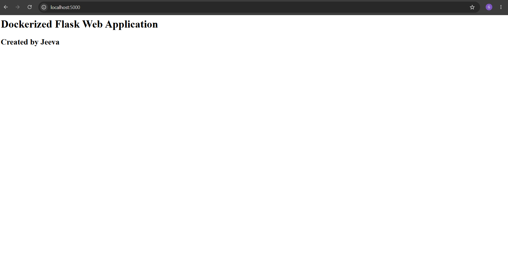

# Dockerized Flask Web Application

## Project Overview
A Flask web application containerized using Docker.

## Technologies Used
- Python Flask
- Docker
- Git
- GitHub

## Project Structure

DockerFlaskApp/
├── app.py
├── requirements.txt
├── Dockerfile
├── README.md
└── screenshots/

## Setup Instructions

### 1. Clone the Repository

git clone <repository-url>

### 2. Navigate to the Project Folder

cd DockerFlaskApp

### 3. Build Docker Image

docker build -t flask-app .

### 4. Run Docker Container

docker run -d -p 5000:5000 flask-app

### 5. Access Application

http://localhost:5000

## Screenshots

### Docker Build

### Running Container

### Application Output

