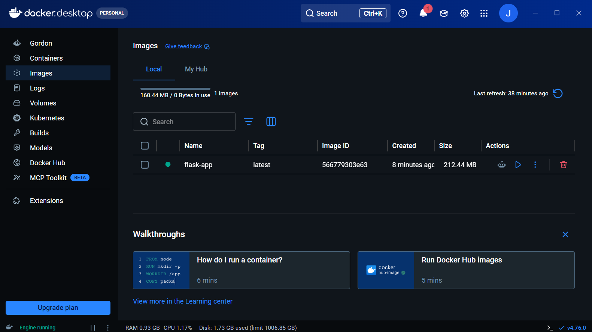

# Dockerized Flask Web Application

## Project Overview
A Flask web application containerized using Docker.

## Technologies Used
- Python Flask
- Docker
- GitHub

## Screenshots

### Docker Build

### Running Container

### Application Output

